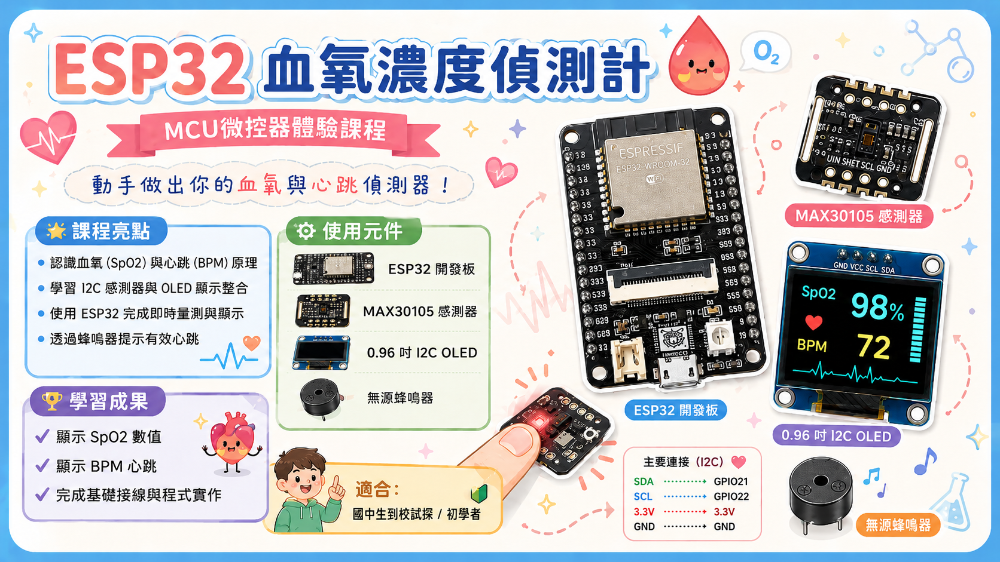
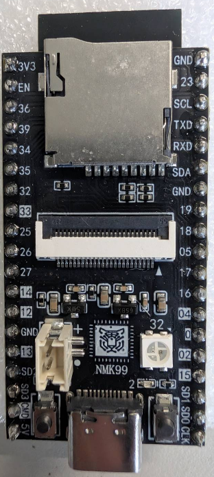
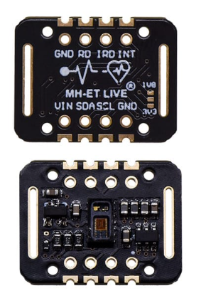
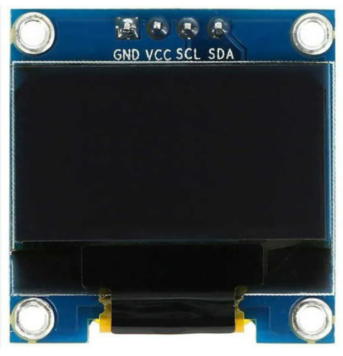

# ESP32 血氧與心率偵測計教學

本專題使用 ESP32、MAX30102/MAX30105 血氧心率感測器、0.96 吋 OLED、無源蜂鳴器與麵包板，製作一套簡易的血氧與心率偵測系統。學生可透過本專題學習微控制器、I2C 通訊、光學感測、OLED 顯示與聲音提示。

```text
ESP32 主控制板
  ├─ I2C → MAX30102/MAX30105 感測器
  ├─ I2C → 0.96 吋 OLED 顯示器
  └─ GPIO / 方波 → 無源蜂鳴器提示音
```

> 注意：本作品是教學與實驗用裝置，不是醫療器材。SpO2 與 BPM 數值僅供觀察感測器與程式運作，不可作為醫療診斷或健康判斷依據。



## 一、課程目標

完成本課程後，學生應能：

1. 認識 ESP32、MAX30102/MAX30105、OLED、蜂鳴器與麵包板的功能。
2. 說明 I2C 的 `SDA`、`SCL` 如何讓多個模組共用同一組訊號線。
3. 完成 ESP32 與感測器、OLED、蜂鳴器的接線。
4. 使用 Arduino IDE 安裝函式庫並上傳程式。
5. 觀察手指放置、晃動、環境光與接觸壓力對量測結果的影響。
6. 用自己的話說明 PPG、BPM 與 SpO2 估算的基本概念。

## 二、專案檔案

| 檔案 | 用途 |
|---|---|
| `main.ino` | Arduino IDE 可直接開啟與上傳的程式 |
| `main.cpp` | 加上較完整註解的程式版本，適合教師講解 |
| `Oxygen_Saturation.fzz` | Fritzing 電路圖原始檔 |
| `poster.png` | 課程海報或成果展示圖 |
| `esp32_實體.png` | ESP32 實體板照片 |
| `esp32_pin_out.png` | ESP32 腳位圖 |
| `MAX30102_pin_out.png` | MAX30102 腳位圖 |
| `oled_pin_out.png` | OLED 腳位圖 |
| `ESP32_血氧濃度偵測計_詳細教學.md` | 完整講義版本 |
| `ESP32_MAX30102_OLED_Buzzer_Breadboard_功能與原理說明.md` | 元件功能與原理說明 |
| `MAX30102_PPG原理_國中生版說明.md` | PPG 原理的國中生版說明 |

## 三、建議閱讀順序

若是老師備課，建議依序閱讀：

1. `五、元件功能與原理`
2. `六、I2C 共用通訊`
3. `七、接線方式`
4. `十二、課堂建議流程`
5. `十三、常見問題與排除`

若是學生實作，建議依序閱讀：

1. `四、材料清單`
2. `七、接線方式`
3. `八、開發環境與函式庫`
4. `九、上傳與測試`
5. `十三、常見問題與排除`

如果課程時間有限，可以先完成接線、上傳與測試，再回頭講解 PPG、I2C 與各元件原理。

## 四、材料清單

| 材料 | 數量 | 說明 |
|---|---:|---|
| ESP32 / NodeMCU-32S 開發板 | 1 | 系統主控制器 |
| MAX30102 或 MAX30105 感測器 | 1 | 取得紅光與紅外線 PPG 訊號 |
| 0.96 吋 128x64 I2C OLED | 1 | 顯示 SpO2、BPM 與狀態 |
| 無源蜂鳴器 | 1 | 偵測到有效心跳時短鳴 |
| 麵包板 | 1 | 免焊接原型電路 |
| 杜邦線 | 數條 | 連接模組與 ESP32 |
| USB 傳輸線 | 1 | 供電與上傳程式 |

建議線色：

- 紅色：3V3 或 VCC
- 黑色：GND
- 藍色或綠色：SDA
- 黃色或白色：SCL
- 其他顏色：蜂鳴器訊號線

## 五、元件功能與原理

### 1. ESP32 開發板

ESP32 是本專題的系統大腦，負責讀取感測器資料、處理訊號、控制 OLED 顯示，並控制蜂鳴器發出提示音。它內建 Wi-Fi 與 Bluetooth，也常用於物聯網、感測器讀取、顯示控制與無線資料傳輸。

ESP32 可以想成一台很小的電腦，內部包含：

| 組成 | 說明 |
|---|---|
| CPU | 執行我們寫的程式 |
| Flash 記憶體 | 儲存程式 |
| GPIO | 控制或讀取外部電子元件 |
| I2C / SPI / UART | 與感測器或模組通訊 |
| PWM | 產生快速高低變化的訊號，可控制蜂鳴器 |
| Wi-Fi / Bluetooth | 可延伸成無線傳輸專題 |

本專題主要使用：

| 腳位 | 用途 |
|---|---|
| 3V3 | 提供 3.3V 電源 |
| GND | 接地 |
| GPIO 21 / SDA | I2C 資料線 |
| GPIO 22 / SCL | I2C 時脈線 |
| GPIO 4 | 控制無源蜂鳴器，對應程式 `Tonepin = 4` |
| BOOT | 上傳程式卡住時可按住進入燒錄模式 |

注意事項：

- ESP32 GPIO 是 3.3V 邏輯，不建議直接輸入 5V 訊號。
- GPIO 34 到 39 只能輸入，不能作為輸出。
- GPIO 0、2、12、15 與開機模式相關，初學時應避免隨意使用。
- 若上傳程式失敗，可在 `Connecting...` 時按住 `BOOT` 鍵。



### 2. MAX30102 / MAX30105 血氧與心率感測器

MAX30102/MAX30105 是光學式心率與血氧感測器。它會發出紅光與紅外線，並偵測手指反射回來的光線變化。這種透過光線觀察血液容積變化的方法稱為 PPG，英文是 Photoplethysmography，中文可稱為光體積變化描記法。

基本流程如下：

```text
紅光與紅外線 LED 發光
        ↓
光線照射手指或皮膚
        ↓
血液吸收部分光線
        ↓
反射光被感測器接收
        ↓
取得紅光與紅外線變化訊號
        ↓
ESP32 分析訊號並估算 BPM 與 SpO2
```

MAX30102/MAX30105 會提供紅光與紅外線的原始資料，ESP32 程式再根據這些資料估算心率與血氧：

| 資料 | 說明 |
|---|---|
| Red 原始訊號 | 感測器讀到的紅光反射量 |
| IR 原始訊號 | 感測器讀到的紅外線反射量 |
| PPG 波形 | 程式從光訊號變化中觀察到的脈搏波形 |
| BPM | 程式根據脈搏波形估算出的心率 |
| SpO2 | 程式根據紅光與紅外線比例估算出的血氧 |

心率 BPM 的概念是：心臟每跳一次，手指血管中的血液量會短暫改變，感測器讀到的反射光也會出現一次波動。程式找出兩次波動之間的時間差，就能換算每分鐘心跳次數。

SpO2 的概念是：氧合血紅素與去氧血紅素對紅光、紅外線的吸收比例不同。程式比較 Red 與 IR 訊號變化比例，再用簡化公式估算血氧濃度。

#### PPG 國中生版重點說明

PPG 這個英文可以拆成三個部分理解：

| 字詞 | 意思 |
|---|---|
| Photo | 光 |
| Plethysmo | 體積變化 |
| Graphy | 記錄 |

所以 PPG 可以簡單理解成：

> 用光來觀察身體裡血液量的變化。

MAX30102/MAX30105 並不是一開始就直接知道 `SpO2 = 98%` 或 `BPM = 75`。它真正讀到的是：

```text
紅光反射值
紅外線反射值
```

然後 ESP32 程式再把這些資料處理成：

```text
PPG 波形
心率 BPM
血氧 SpO2
```

可以把手指想像成一杯有紅色墨水的水。墨水比較多時，光比較不容易穿過或反射回來；墨水比較少時，光比較容易穿過或反射回來。血液也有類似的效果：

```text
血液多 → 吸收較多光 → 感測器收到的光較少
血液少 → 吸收較少光 → 感測器收到的光較多
```

當心臟跳動時，手指內的血液量會一多一少，反射光強度也會跟著一高一低，形成 PPG 波形：

```text
光強變化：
＿／＼＿／＼＿／＼＿／＼＿
   ↑   ↑   ↑   ↑
  一次心跳
```

每出現一個明顯波峰，就可以視為一次脈搏。如果 1 分鐘內偵測到 75 次波峰，就是：

```text
心率 = 75 BPM
```

BPM 是 Beats Per Minute 的縮寫，意思是每分鐘心跳次數。

血氧 SpO2 的估算則需要比較紅光與紅外線，因為血液裡有兩種主要狀態的血紅素：

| 名稱 | 說明 |
|---|---|
| 氧合血紅素 | 帶有氧氣的血紅素 |
| 去氧血紅素 | 沒有帶氧氣的血紅素 |

這兩種血紅素對紅光與紅外線的吸收能力不同，所以感測器不是直接「看到氧氣」，而是透過光被吸收的比例變化來推算血氧。

用一句話說明：

> PPG 是利用光照射皮膚，觀察血液隨心跳變多變少時造成的反射光變化，進而估算心跳與血氧的方法。

常見腳位：

| 腳位 | 功能 |
|---|---|
| VCC / VIN | 電源輸入，建議接 3.3V |
| GND | 接地 |
| SDA | I2C 資料線 |
| SCL | I2C 時脈線 |
| INT | 中斷腳，本專題可不接 |

量測注意事項：

- 手指需穩定貼合感測器。
- 手指晃動會讓波形變亂。
- 壓太緊會影響血流。
- 壓太鬆會讓反射光不穩。
- 強光直射會干擾感測。
- 手指太冷或血液循環較差時，訊號可能較弱。



### 3. 0.96 吋 OLED 顯示模組

OLED 是小型顯示模組，常見解析度為 128 x 64 像素，可顯示文字、數字、簡單圖形與狀態訊息。本專題用它顯示 SpO2、BPM、手指狀態與量測提示。

OLED 的全名是 Organic Light Emitting Diode，中文為有機發光二極體。它的特色是每個像素可以自行發光，不需要 LCD 常見的背光模組，因此黑底白字清楚、反應快、體積小，適合低功耗小型裝置。

0.96 吋 OLED 模組通常使用 SSD1306 或 SH1106 驅動晶片。ESP32 不會直接控制每一個像素，而是透過 I2C 傳送畫面資料給 OLED 控制晶片，再由控制晶片驅動畫面。

顯示流程如下：

```text
ESP32 程式決定畫面內容
        ↓
Adafruit SSD1306 / GFX 函式庫把文字轉成像素資料
        ↓
透過 I2C 傳給 OLED 控制晶片
        ↓
OLED 顯示 SpO2、BPM 與提示文字
```

常見腳位：

| 腳位 | 功能 |
|---|---|
| VCC | 電源正極，建議接 3.3V |
| GND | 接地 |
| SDA | I2C 資料線 |
| SCL | I2C 時脈線 |

常見 I2C 位址：

| 模組 | 常見位址 |
|---|---|
| SSD1306 OLED | `0x3C` |
| 部分 OLED | `0x3D` |

若 OLED 沒有畫面，請先檢查 VCC、GND、SDA、SCL，再確認程式中的 OLED 位址。



### 4. 無源蜂鳴器

無源蜂鳴器是一種發聲元件，可用於提示音、按鍵音、警示音與簡單旋律。本專題在偵測到有效心跳時會短鳴一次，讓學生能聽到心跳偵測事件。

無源蜂鳴器內部沒有固定振盪電路，不能只靠接上直流電源持續發聲。它需要 ESP32 輸出方波或 PWM 訊號，讓內部振動片快速震動，推動空氣產生聲音。

```text
ESP32 輸出方波
        ↓
蜂鳴器內部振動片震動
        ↓
空氣振動
        ↓
產生聲音
```

程式中的短鳴控制：

```cpp
tone(Tonepin, 1000, 10);
```

意思是 ESP32 在 `Tonepin` 腳位輸出約 `1000 Hz` 的聲音，持續 `10 ms`。頻率越高，聲音越尖；頻率越低，聲音越低沉。

無源與有源蜂鳴器差異：

| 比較項目 | 無源蜂鳴器 | 有源蜂鳴器 |
|---|---|---|
| 內部振盪電路 | 沒有 | 有 |
| 接上直流電 | 通常不會持續叫 | 會直接叫 |
| 是否可改變音調 | 可以 | 通常不行 |
| 是否可播放旋律 | 可以 | 不適合 |
| 控制方式 | 方波 / PWM | 高低電位 |

### 5. 麵包板

麵包板是一種免焊接電路實驗板。它內部有金屬導通彈片，插入杜邦線或元件腳位後，可以讓特定孔位彼此相通，方便快速建立與修改電路。

常見麵包板分成兩種區域：

| 區域 | 說明 |
|---|---|
| 電源軌 | 通常標示紅色 `+` 與藍色 `-`，用來分配 3.3V 與 GND |
| 中間實驗區 | 通常每 5 個孔為一組相通，適合插元件與接訊號線 |

常見接法：

```text
ESP32 3V3 → 麵包板紅色 + 電源軌
ESP32 GND → 麵包板藍色 - 電源軌

OLED VCC     → 紅色 + 電源軌
MAX30102 VCC → 紅色 + 電源軌
OLED GND     → 藍色 - 電源軌
MAX30102 GND → 藍色 - 電源軌
```

注意事項：

- 電源正負不可接反。
- 3.3V 與 GND 不可短路。
- 有些麵包板電源軌中間是斷開的，必要時要用跳線接通。
- 插線太鬆或接觸不良會造成模組讀不到或 ESP32 重開機。
- I2C 線不宜太長，否則通訊可能不穩。

## 六、I2C 共用通訊

I2C 是常見的雙線式通訊方式，只需要兩條訊號線：

| 訊號線 | 功能 |
|---|---|
| SDA | 資料線，傳送資料 |
| SCL | 時脈線，同步傳輸節奏 |

同一組 I2C 線上可以接多個裝置，每個裝置用不同位址識別自己。可以想成同一間教室裡老師點名，所有人都聽得到聲音，但只有被叫到名字的人要回應。

本專題中，ESP32 是主控端，OLED 與 MAX30102/MAX30105 是被控制的裝置：

```text
ESP32 GPIO21 SDA ── OLED SDA
                 └─ MAX30102/MAX30105 SDA

ESP32 GPIO22 SCL ── OLED SCL
                 └─ MAX30102/MAX30105 SCL
```

常見 I2C 位址：

| 裝置 | 常見位址 |
|---|---|
| OLED SSD1306 | `0x3C` |
| MAX30102/MAX30105 | `0x57` |

## 七、接線方式

接線前請先拔掉 USB 電源。完成後，先檢查 3V3 與 GND 沒有接反或短路，再接上電腦。

本專題程式中蜂鳴器腳位為：

```cpp
const int Tonepin = 4;
```

因此蜂鳴器正極請接 `GPIO 4`。

| 元件 | 元件腳位 | 接到 ESP32 | 說明 |
|---|---|---|---|
| OLED | VCC | 3V3 | 螢幕電源 |
| OLED | GND | GND | 接地 |
| OLED | SDA | GPIO 21 / SDA | I2C 資料線 |
| OLED | SCL | GPIO 22 / SCL | I2C 時脈線 |
| MAX30102/MAX30105 | VCC / VIN | 3V3 | 感測器電源 |
| MAX30102/MAX30105 | GND | GND | 接地 |
| MAX30102/MAX30105 | SDA | GPIO 21 / SDA | 與 OLED 共用 |
| MAX30102/MAX30105 | SCL | GPIO 22 / SCL | 與 OLED 共用 |
| 無源蜂鳴器 | + | GPIO 4 | 心跳提示音 |
| 無源蜂鳴器 | - | GND | 接地 |

> 有些 ESP32 板子會直接印 `SDA`、`SCL`，有些則只印 `21`、`22`。若板子不同，請以板上腳位圖為準。

## 八、開發環境與函式庫

### 1. 安裝 ESP32 開發板套件

在 Arduino IDE 中打開：

```text
工具 -> 開發板 -> 開發板管理員
```

搜尋並安裝：

```text
esp32 by Espressif Systems
```

開發板可選：

```text
NodeMCU-32S
```

若你的板子不是 NodeMCU-32S，也可以選對應的 ESP32 Dev Module 類型。

### 2. 安裝函式庫

在 Arduino IDE 中打開：

```text
工具 -> 管理程式庫
```

搜尋並安裝：

| 函式庫 | 作者 | 用途 |
|---|---|---|
| `Adafruit SSD1306` | Adafruit | 控制 OLED |
| `Adafruit GFX Library` | Adafruit | 顯示文字與圖形 |
| `Adafruit BusIO` | Adafruit | Adafruit 函式庫依賴 |
| `SparkFun MAX3010x Pulse and Proximity Sensor Library` | SparkFun | 讀取 MAX30102/MAX30105 |

程式中會使用：

```cpp
#include <Wire.h>
#include <Adafruit_GFX.h>
#include <Adafruit_SSD1306.h>
#include "MAX30105.h"
#include "heartRate.h"
```

## 九、上傳與測試

### 1. 上傳程式

1. 將 ESP32 用 USB 線接上電腦。
2. 用 Arduino IDE 開啟 `main.ino`。
3. 選擇開發板，例如 `NodeMCU-32S`。
4. 選擇正確的 `COM Port`。
5. 確認 OLED 位址為 `0x3C`：

   ```cpp
   #define OLED_ADDR 0x3C
   ```

6. 按下上傳。
7. 上傳完成後，OLED 應出現開機畫面，接著顯示 `PLACE FINGER ON SENSOR`。

如果 OLED 沒有畫面，可將 OLED 位址改成：

```cpp
#define OLED_ADDR 0x3D
```

### 2. 實際量測

1. 將手指平放在 MAX30102/MAX30105 感測器上。
2. 不要太用力按壓，也不要讓手指晃動。
3. 等待數秒，OLED 會顯示：
   - `SpO2`：血氧估算值
   - `BPM`：心率估算值
   - `Measuring...`：正在量測
   - `Keep still`：請保持穩定
4. 每偵測到一次有效心跳，蜂鳴器會短鳴一次。

觀察問題：

- 手指剛放上去時，數值是否需要時間才會穩定？
- 手指晃動時，BPM 是否會跳動？
- 手指壓太緊或太鬆時，是否比較難測到？
- 感測器被強光照射時，結果是否會變得不穩？

## 十、系統工作流程

```text
系統啟動
    ↓
ESP32 初始化 I2C
    ↓
初始化 OLED
    ↓
初始化 MAX30102/MAX30105
    ↓
讀取紅光與紅外線資料
    ↓
判斷是否有手指放置
    ↓
估算 BPM 與 SpO2
    ↓
OLED 顯示數值與狀態
    ↓
偵測到有效心跳時，蜂鳴器短鳴
```

## 十一、程式重點

### 1. 判斷手指是否放上感測器

```cpp
#define FINGER_ON 7000
```

程式會讀取紅外線 `IR` 值。當 IR 值高於門檻時，視為手指已放上感測器。

### 2. 偵測心跳

```cpp
if (checkForBeat(irValue)) {
  ...
}
```

`checkForBeat()` 會從 IR 訊號中尋找心跳波形。每找到一次有效心跳，就計算兩次心跳之間的時間差，再換算成 BPM。

### 3. 平滑 BPM

```cpp
const byte RATE_SIZE = 8;
```

程式會取最近 8 次有效 BPM 做平均，避免畫面數字跳動太劇烈。

### 4. 估算 SpO2

```cpp
double R = (sqrt(sumredrms) / avered) / (sqrt(sumirrms) / aveir);
SpO2 = -23.3 * (R - 0.4) + 100.0;
```

血氧估算會比較紅光與紅外線訊號的變化比例。這是教學用的簡化估算，不是醫療級校正公式。

### 5. OLED 顯示

```cpp
drawMainScreen(fingerOn);
```

畫面會依照是否有手指，切換成提示畫面或數值畫面。

### 6. 蜂鳴器提示

```cpp
tone(Tonepin, 1000, 10);
```

每次偵測到有效心跳時，蜂鳴器會發出短促提示音。

## 十二、課堂建議流程

| 時間 | 活動 |
|---:|---|
| 5 分鐘 | 介紹作品目標與安全注意事項 |
| 10 分鐘 | 認識 ESP32、MAX30102/MAX30105、OLED、蜂鳴器、麵包板 |
| 10 分鐘 | 說明 PPG、I2C 與 OLED 顯示原理 |
| 15 分鐘 | 學生分組接線，老師巡視電源、共地與 I2C 腳位 |
| 10 分鐘 | 安裝函式庫、選擇開發板與 COM Port |
| 10 分鐘 | 上傳程式並排除連線問題 |
| 15 分鐘 | 實際量測與觀察數值變化 |
| 10 分鐘 | 討論誤差來源、生活應用與安全聲明 |

若課程時間較短，可先由老師完成函式庫與開發板環境，學生主要負責接線、上傳與觀察。

## 十三、常見問題與排除

| 問題 | 可能原因 | 解決方式 |
|---|---|---|
| OLED 不亮 | 電源接錯、I2C 位址錯 | 檢查 VCC/GND/SDA/SCL，嘗試 `0x3C` 或 `0x3D` |
| 顯示 `SENSOR ERROR` | 感測器接線錯、供電錯誤 | 檢查 MAX30102/MAX30105 的 VCC、GND、SDA、SCL |
| 數值亂跳 | 手指晃動、壓太緊、環境光干擾 | 固定手指，避開強光，等待數值穩定 |
| 蜂鳴器不叫 | 腳位接錯、不是無源蜂鳴器、接觸不良 | 確認正極接 GPIO 4、負極接 GND |
| ESP32 一直重開 | 短路或供電不足 | 檢查麵包板電源軌與 USB 線 |
| I2C 裝置找不到 | SDA/SCL 接錯或線太長 | 檢查 GPIO21/GPIO22，縮短線材 |
| 編譯出現 `I2C_BUFFER_LENGTH` warning | 函式庫重複定義 buffer | 若最後能編譯上傳，通常可先忽略 |

上傳時如果一直停在 `Connecting...`，可按住 ESP32 的 `BOOT` 鍵，等開始上傳後再放開。也可把上傳速度改成：

```text
工具 -> Upload Speed -> 115200
```

## 十四、延伸挑戰

完成基本功能後，可以讓學生嘗試：

1. 修改蜂鳴器音調或持續時間。
2. 改變 OLED 顯示版面。
3. 顯示 IR 或 Red 原始數值。
4. 調整 `FINGER_ON` 門檻，觀察手指偵測靈敏度。
5. 加入 SpO2 或 BPM 警示條件。
6. 使用 Wi-Fi 將資料上傳到網頁或雲端。
7. 設計外殼或固定架，讓手指更穩定。

## 十五、專題報告可用說明

本專題使用 ESP32 作為主控制器，搭配 MAX30102/MAX30105 光學式心率與血氧感測器、0.96 吋 OLED 顯示模組、無源蜂鳴器與麵包板完成系統原型。MAX30102/MAX30105 透過紅光與紅外線偵測手指血液流動造成的反射光變化，形成 PPG 脈搏訊號，再由 ESP32 讀取資料並進行心率與血氧濃度估算。OLED 顯示模組用於顯示 SpO2、BPM 與狀態訊息，無源蜂鳴器則作為心跳提示或警示輸出。麵包板提供免焊接接線環境，方便在開發初期快速建立與測試電路。

由於本系統屬於教學與專題實作用途，MAX30102/MAX30105 所得到的血氧與心率數值僅作為實驗參考，不應作為醫療診斷或健康判斷依據。

## 十六、教學提醒

- 量測前請提醒學生，本作品不是醫療器材。
- 接線前先拔掉 USB 電源，避免短路。
- 初學時建議感測器與 OLED 都接 3V3。
- 所有模組必須共地，也就是 GND 要接在一起。
- OLED 與感測器可以共用 SDA/SCL，但每個模組都要接 VCC 與 GND。
- 若分組進行，建議每組先由一位同學負責檢查電源線與地線，再上電測試。
