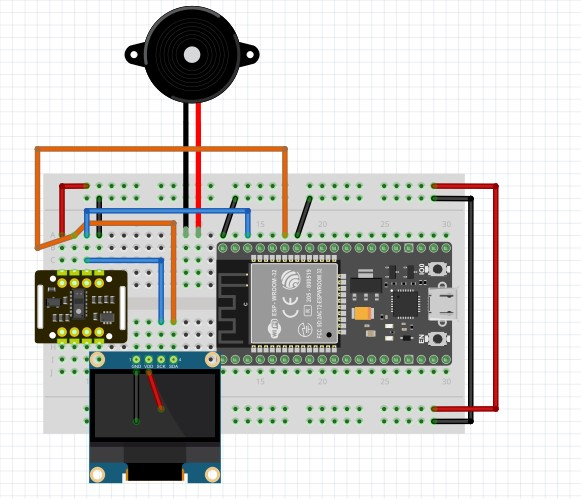

# ESP32 血氧心率 OLED 顯示器

這是一個用 ESP32 做的小型血氧心率顯示器。

目前螢幕是 0.96 吋 128x64 I2C OLED

* SpO2 血氧
* BPM 心率
* 感測器狀態
* 手指是否有放好

## 使用的硬體

* ESP32 / NodeMCU-32S
* MAX30102 或 MAX30105 血氧心率感測器
* 0.96 吋 OLED 顯示幕
  * 128x64
  * I2C / IIC
  * 4 Pin
  * 常見 SSD1306 驅動
* 杜邦線

## 接線方式

OLED 跟 MAX30102 / MAX30105 都是 I2C，所以可以接在同一組 SDA / SCL 上。



ESP32 常用接法：

```text
OLED VCC  -> 3V3 或 5V
OLED GND  -> GND
OLED SDA  -> GPIO 21
OLED SCL  -> GPIO 22

MAX30102 VCC -> 3V3 或 5V
MAX30102 GND -> GND
MAX30102 SDA -> GPIO 21
MAX30102 SCL -> GPIO 22
```

如果你的模組標示不是 SDA / SCL，而是其他名字，基本上也是照 I2C 腳位去接。

接線圖原始檔可以下載 `Oxygen_Saturation.fzz`，使用 Fritzing 開啟後可以自行修改。

## 需要安裝的 Library

Arduino IDE 裡面到：

```text
工具 -> 管理程式庫
```

然後搜尋並安裝下面這幾個。

### 1. Adafruit SSD1306

OLED 顯示幕用的 Library。

搜尋：

```text
Adafruit SSD1306
```

作者選 Adafruit。

### 2. Adafruit GFX Library

這是 OLED 畫文字、畫線、畫圖形會用到的核心 Library。

搜尋：

```text
Adafruit GFX Library
```

作者選 Adafruit。

### 3. Adafruit BusIO

Adafruit 的顯示相關 Library 常常會用到這個。

搜尋：

```text
Adafruit BusIO
```

如果安裝 Adafruit SSD1306 的時候 Arduino IDE 問你要不要一起安裝依賴套件，直接選全部安裝就可以。

### 4. SparkFun MAX3010x Pulse and Proximity Sensor Library

這個是 MAX30102 / MAX30105 血氧心率感測器用的。

搜尋：

```text
SparkFun MAX3010x Pulse and Proximity Sensor Library
```

作者選 SparkFun。

程式裡會用到：

```cpp
#include "MAX30105.h"
#include "heartRate.h"
```

所以這個一定要裝。

## ESP32 開發板套件

如果 Arduino IDE 還沒有 ESP32 開發板，需要先安裝 ESP32 Board Package。

到：

```text
工具 -> 開發板 -> 開發板管理員
```

搜尋：

```text
esp32
```

安裝：

```text
esp32 by Espressif Systems
```

開發板可以選：

```text
NodeMCU-32S
```

## OLED 位址

這種 0.96 吋 I2C OLED 最常見的位址是：

```cpp
#define OLED_ADDR 0x3C
```

如果燒錄後 OLED 沒畫面，可以試著改成：

```cpp
#define OLED_ADDR 0x3D
```

通常不是 `0x3C` 就是 `0x3D`。

## 上傳時如果卡在 Connecting

ESP32 有時候不會自動進入燒錄模式，會出現類似：

```text
Failed to connect to ESP32
Wrong boot mode detected
```

這不是程式錯，是板子沒有進 download mode。

解法：

1. 按 Arduino IDE 的上傳
2. 下面出現 `Connecting...` 的時候
3. 按住 ESP32 上的 `BOOT` 鍵
4. 等它開始燒錄後再放開

如果還是不行，可以先把上傳速度改成：

```text
115200
```

路徑：

```text
工具 -> Upload Speed -> 115200
```

## 編譯時出現 I2C_BUFFER_LENGTH warning

如果看到這個：

```text
warning: "I2C_BUFFER_LENGTH" redefined
```

可以先不用管。

這通常是 ESP32 的 Wire Library 跟 SparkFun MAX3010x Library 都有定義 I2C buffer，雖然會跳 warning，但不影響編譯，也不影響上傳。

只要最後有出現類似這種：

```text
草稿碼使用了 xxx bytes
全域變數使用了 xxx bytes
```

代表程式已經編譯成功。

## 使用方式

1. 接好 OLED 跟 MAX30102 / MAX30105
2. 開啟 Arduino IDE
3. 選擇開發板 `NodeMCU-32S`
4. 選擇正確的 COM Port
5. 按上傳
6. 燒錄完成後，把手指放到感測器上
7. OLED 會顯示血氧跟心率

## 注意事項

這個是 DIY 測試用的血氧心率顯示器，不是醫療設備。

數值會受到很多東西影響，例如：

* 手指有沒有放好
* 手指有沒有晃動
* 感測器壓太緊或太鬆
* 環境光太強
* 模組品質
* 電源是否穩定

所以數值可以拿來參考，但不能當成醫療判斷依據。
